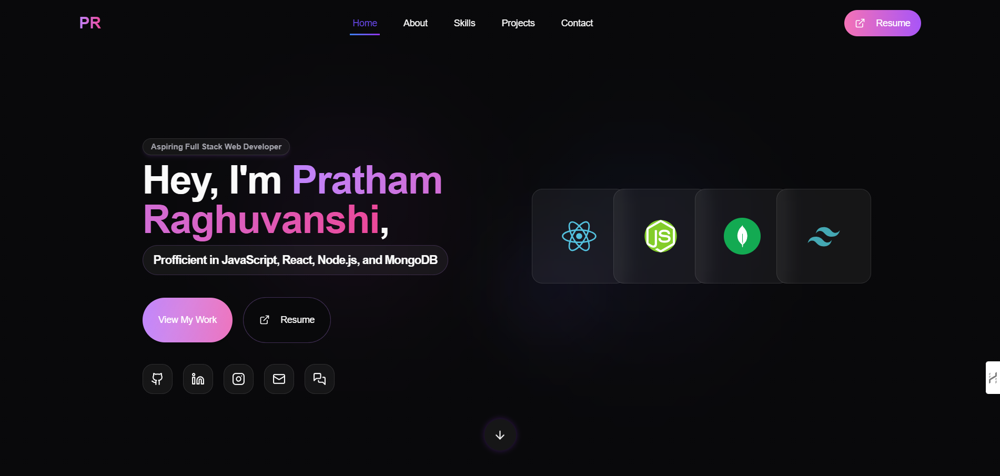

# Pratham Raghuvanshi - Portfolio Website

 *A modern, immersive, and responsive personal portfolio.*

This repository contains my personal portfolio website, designed to showcase my skills, projects, and professional experience as a Full Stack Web Developer. Built with an emphasis on modern UI/UX principles, the portfolio features engaging animations, dynamic 3D elements, and a clean, industry-standard aesthetic.

## Live Demo & Resources
1. **Live Site**: [prathamraghuvanshi.com](#) *(Add actual link if deployed)*
2. **My Resume**: [View PDF (`/resume.html`)](https://github.com/Pratham22R/Portfolio_/blob/main/public/PrathamRaghuvanshiResume.pdf)
3. **LinkedIn**: [linkedin.com/in/pratham-raghuvanshi](#) *(Update with your actual LinkedIn)*
4. **GitHub**: [github.com/Pratham22R](https://github.com/Pratham22R)

---

## Features

1. **Modern & Immersive UI**: High-end aesthetic with custom glassmorphism, dynamic gradients, and micro-animations to enhance user engagement.
2. **Responsive Design**: Flawless experience across all devices (Desktop, Tablet, Mobile).
3. **Interactive 3D Elements**: Integrated Three.js and React Three Fiber for a visually stunning hero section.
4. **Projects Showcase**: Detailed sections highlighting web applications, full-stack projects, and their respective tech stacks.
5. **Skill Grid**: A sleek visualization of my technical proficiencies ranging from frontend frameworks to backend technologies and databases.
6. **Dark Mode Optimized**: Built from the ground up to respect dark mode preferences with beautiful contrasting typography.

---

## Tech Stack

This project was built utilizing a robust and modern technology stack:

### Framework & Core
1. **[React 18](https://react.dev/)**: Core component-based UI library.
2. **[Vite](https://vitejs.dev/)**: Next-generation, lightning-fast frontend tooling and bundler.
3. **[TypeScript](https://www.typescriptlang.org/)**: Strongly typed JavaScript for safer and more maintainable code.

### Styling & UI Components
1. **[Tailwind CSS](https://tailwindcss.com/)**: Utility-first CSS framework for rapid, custom UI development.
2. **[Shadcn UI / Radix primitives](https://ui.shadcn.com/)**: Accessible, customizable, and headless UI components.
3. **[Lucide React](https://lucide.dev/)**: Beautiful and consistent iconography.

### Animations & 3D
1. **[GSAP](https://gsap.com/)**: Industry-standard robust animation library.
2. **[Three.js](https://threejs.org/) & [React Three Fiber](https://docs.pmnd.rs/react-three-fiber)**: Powerful 3D rendering and canvas manipulation.

### Tooling
1. **[ESLint](https://eslint.org/)**: Code linting.
2. **[PostCSS](https://postcss.org/)**: CSS transformations.

---

## Getting Started

To run this project locally, simply follow these steps.

### Prerequisites
Make sure you have [Node.js](https://nodejs.org/) (v16 or higher) and `npm` installed.

### Installation

1. **Clone the repository:**
   ```bash
   git clone https://github.com/Pratham22R/Portfolio_.git
   cd Portfolio_
   ```

2. **Install dependencies:**
   ```bash
   npm install
   ```

3. **Start the development server:**
   ```bash
   npm run dev
   ```

4. **Navigate to your local environment:**
   Open [http://localhost:5173](http://localhost:5173) in your browser.

---

## Project Structure highlights

1. `src/components/` - Reusable UI elements (Hero, Navbar, Footer, Projects, Skills)
2. `src/pages/` - Main views (Index.tsx)
3. `src/lib/` - Utility functions and animation hooks
4. `public/` - Static assets, images, Resume PDF, and custom HTML wrapper for resume viewing

---

## Let's Connect!

I am actively seeking Full Stack Web Development opportunities. Whether you have a project in mind, an opportunity to discuss, or just want to say hi, feel free to reach out to me!

**Email**: pratham2262003@gmail.com
**LinkedIn**: [linkedin.com/in/pratham-raghuvanshi](#)
**GitHub**: [@Pratham22R](https://github.com/Pratham22R)

---
*Created by Pratham Raghuvanshi.*
